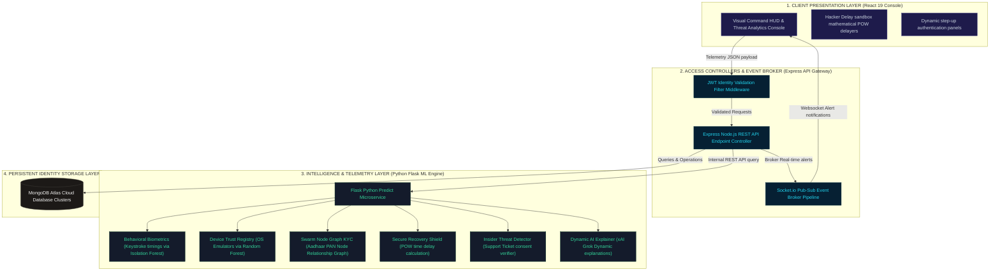
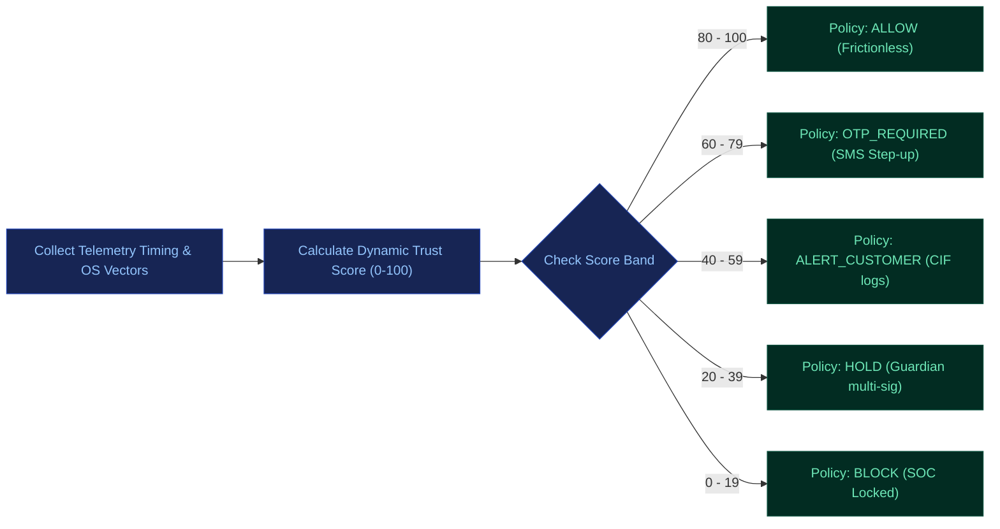

# 🛡️ Sach Ka Kavach — Bharat Trust Grid
### *Continuous Identity Trust & Adaptive Risk Interception Engine*

Designed and built for the **Bank of Baroda Hackathon 2026**, **Sach Ka Kavach** is a privacy-first, continuous risk-based Identity Trust Grid that monitors digital channels in real-time. By moving away from rigid binary logins, the engine continuously re-evaluates identity signals and locks down accounts dynamically, ensuring maximum security for vulnerable demographics with zero friction for normal users.

---

## 📌 Understanding of the Problem (Core Vulnerabilities)

Traditional banking security structures suffer from fundamental flaws:
1. **Inadequacy of Static Credentials**: Passwords and static OTPs are no longer sufficient against modern phishing, SIM swaps, and credential theft.
2. **Binary, Point-in-Time Verification**: Existing systems verify identity only once during login and do not continuously assess whether the user is still the genuine account holder.
3. **Undetected Hijacking Signals**: Account takeover attempts go unnoticed despite indicators like unusual transaction amounts, abnormal login cadences, location changes, or new device signatures.
4. **Weak KYC Onboarding Pipelines**: Fraudsters create fake, mule, or synthetic accounts by exploiting gaps in the KYC registration checks.
5. **Vulnerable Account Recovery Loops**: Suspicious account recovery requests (password resets or mobile changes) are misused to hijack profiles.
6. **Privileged Insider Misuse**: Bank employees can query customer records arbitrarily without immediate real-time authorization checks.
7. **Exploitation of Vulnerable Demographics**: Elderly, hospitalized, unconscious, or digitally less-aware customers cannot immediately recognize or respond to fraud.
8. **High Friction, Low Security**: A one-size-fits-all security approach creates unnecessary friction for genuine customers while failing to stop sophisticated fraud.

---

## ⚙️ Our Solution: Detailed Module-Wise Breakdown

**Sach Ka Kavach** addresses these challenges by implementing six modular security layers that continually calculate a dynamic trust score (0-100) and enforce adaptive security policies:

### 1. Behavioral Anomaly Detection (M1)
* **Goal**: Detects session takeovers by profiling how the user interacts with the system.
* **Mechanism**: Captures micro-timing parameters (keystroke press durations and key flight intervals) on client inputs. Timings are evaluated in real-time by a Python **Isolation Forest** model to detect deviations from the customer's typing cadence baseline.
* **Example**: A customer who usually transfers ₹5,000 suddenly attempts a ₹2,00,000 transfer at 3 AM. The engine detects both transaction and typing timing anomalies, immediately raising a high-risk alert.

### 2. Device Trust Registry (M2)
* **Goal**: Blocks unrecognized, automated, or spoofed devices from accessing accounts.
* **Mechanism**: Gathers multi-signal telemetry parameters (OS headers, screen resolution, browser profiles, user agent fingerprints, and network proxy states) and evaluates them using a **Random Forest** classification model to identify emulators or device hijacking signatures.
* **Example**: A login attempt from a new phone and browser brand is detected. The Device Trust Registry flags it as unrecognized, prompting the user for step-up verification before access is granted.

### 3. Fraud Ring Detection (M3)
* **Goal**: Discovers and intercepts synthetic KYC onboarding rings.
* **Mechanism**: Constructs a relationship node graph tracking PAN, Aadhaar, device IDs, and IP addresses. The **Swarm KYC Graph Engine** clusters nodes to find accounts sharing matching hardware fingerprints or recovery nominees.
* **Example**: Multiple bank accounts are created using the same mobile device ID and IP address. The graph engine immediately flags the overlapping clusters as a potential mule account network for manual verification.

### 4. Account Recovery Risk Assessment (M4)
* **Goal**: Secures the password and mobile number reset pipelines.
* **Mechanism**: Creates a secure, isolated sandbox with dynamic delays and proof-of-work (PoW) computation tasks that slow down automated scripts.
* **Example**: A password reset request is followed immediately by a request to change the primary mobile number from an unrecognized device. The system increases the account recovery risk score, pausing the process to notify the owner.

### 5. Insider Threat Monitoring (M5)
* **Goal**: Mitigates administrative database snooping and data exfiltration by bank staff.
* **Mechanism**: Establishes a **Customer Consent Ticket** gateway. Bank employees are forbidden from querying user databases unless the customer has raised a support ticket and authorized it via an SMS OTP.
* **Example**: A bank employee attempts to search and download hundreds of customer records outside working hours. The system immediately blocks the request and triggers a high-priority SOC alert to the manager.

### 6. Real-Time Audit Ledger (M6)
* **Goal**: Provides complete transparency, compliance, and post-incident investigation logs.
* **Mechanism**: An immutable chronological log recording all system-level identity trust events, risk changes, verification results, and admin queries.
* **Example**: Every login, transaction, risk score update, and security policy decision is logged with absolute timestamps, providing investigators with an auditable trial.

---

## 📊 Detailed System Architecture

---

## 🔄 Dynamic Risk Interception Flow

---

## 🛠️ Technology Stack

| Layer | Component | Description |
| :--- | :--- | :--- |
| **Frontend** | React 19, TypeScript, Tailwind CSS, Vite | Fully responsive dashboard layout, motion micro-interactions, Recharts analytics, global notification toasts. |
| **Backend API** | Node.js, Express, Socket.io | Core database controllers, event pipelines, and real-time Socket notifications. |
| **Database** | MongoDB Atlas, Mongoose | Persistent storage for users, transactions, audit logs, and employee tickets. |
| **Machine Learning** | Python, Flask, Scikit-Learn | Real-time prediction microservice (Isolation Forest, Random Forest). |
| **AI Explanation** | xAI Grok API, Groq Llama 3.3 | Real-time generation of human-readable risk summaries & action justifications. |

---

## 👥 The Development Team — Sach Ka Kavach

* **Chitra Saini** (Team Leader) 
  * **Role**: Frontend Architecture & Onboarding UX
  * **Gmail**: [chitra24279@gmail.com](mailto:chitra24279@gmail.com)
  
* **Abhyuday Jain** 
  * **Role**: Backend Services & Escrow Security Pipelines
  * **Gmail**: [abhyuday.23it616@rtu.ac.in](mailto:abhyuday.23it616@rtu.ac.in)
  
* **Hardik Mathur** 
  * **Role**: Machine Learning Models & System Integrations
  * **Gmail**: [hardikmathur11@gmail.com](mailto:hardikmathur11@gmail.com)
  
* **Siddharth Raut** 
  * **Role**: Risk Algorithms & Threat Overwatch Workflows
  * **Gmail**: [siddharthraut.risk@gmail.com](mailto:siddharthraut.risk@gmail.com)

---

## 🌐 Active Deployments

* **Production Frontend**: [https://sach-kavach-grid.vercel.app](https://sach-kavach-grid.vercel.app)
* **Production API Backend**: [https://sach-ka-kavach.onrender.com](https://sach-ka-kavach.onrender.com)
* **Production ML Service**: [https://sach-kavach-ml-service.onrender.com](https://sach-kavach-ml-service.onrender.com) (Health endpoint at `/health`)
